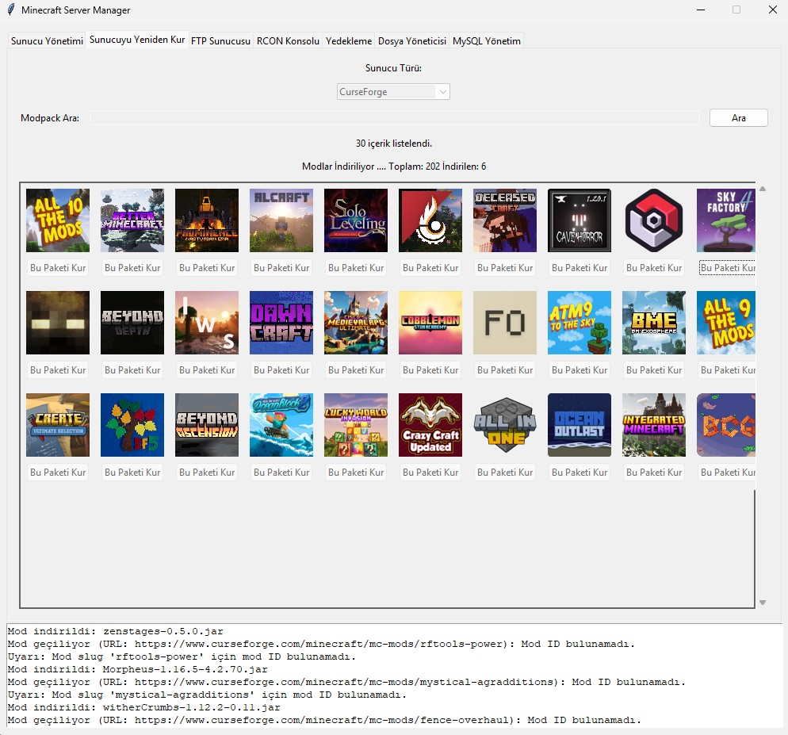
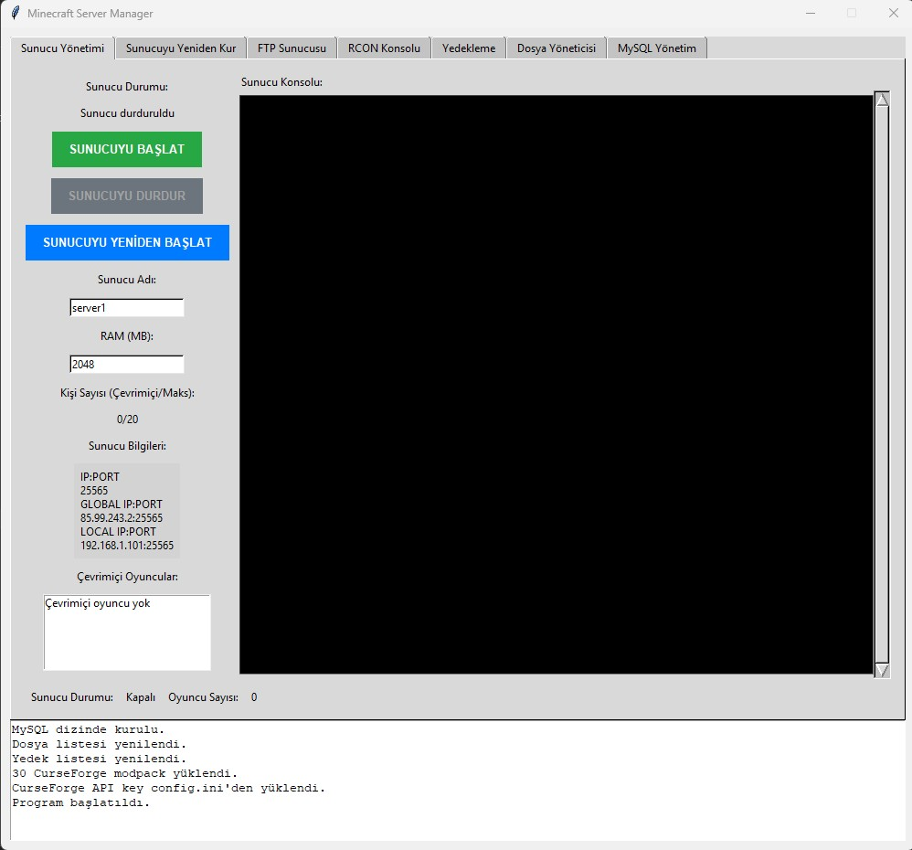
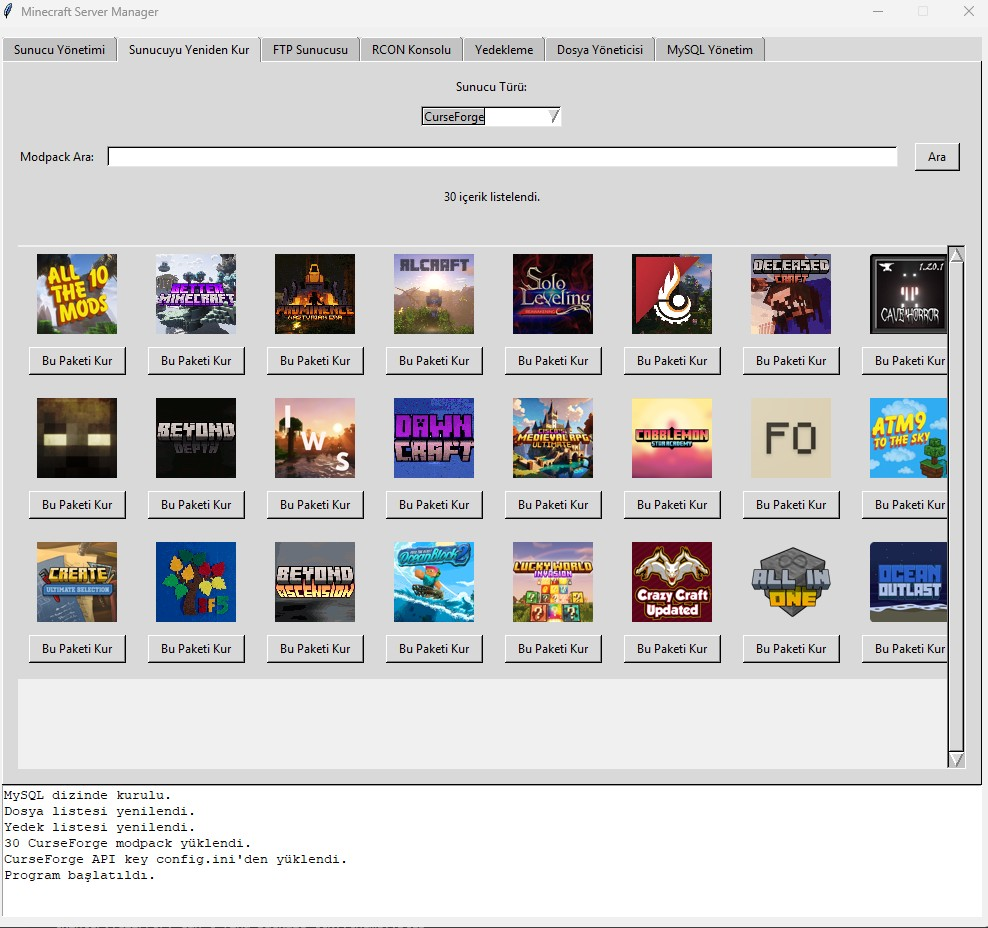
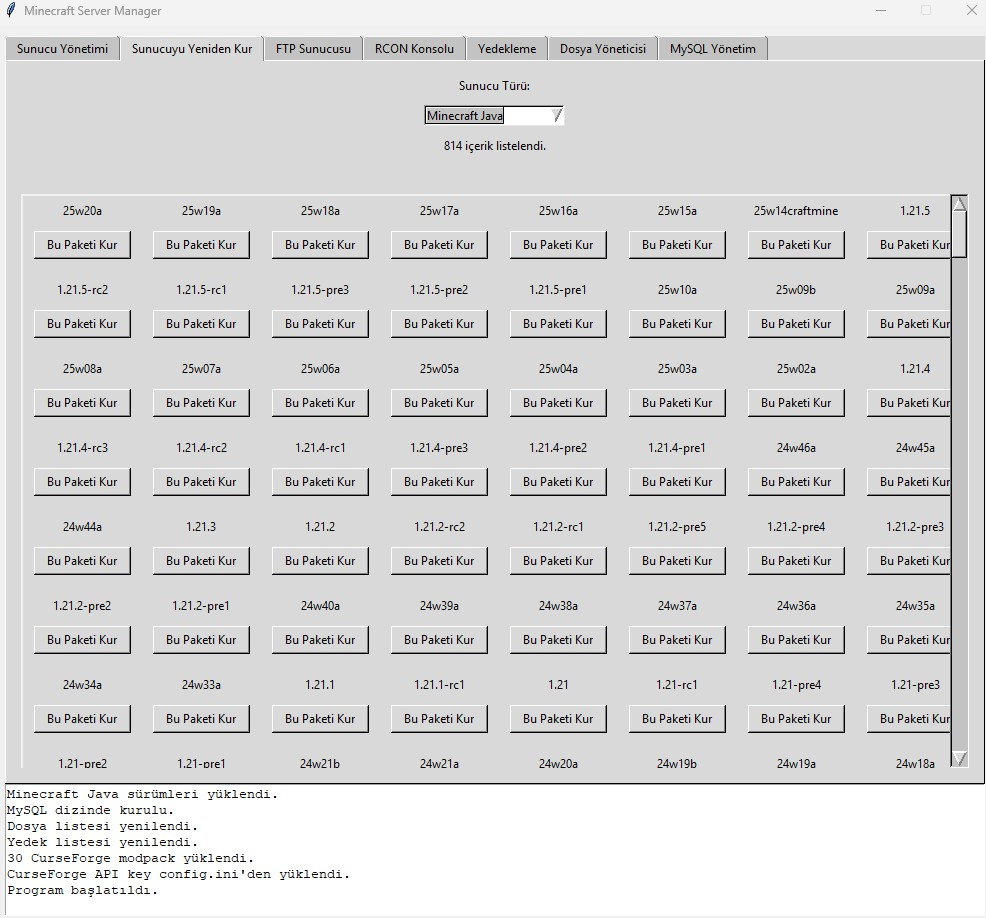
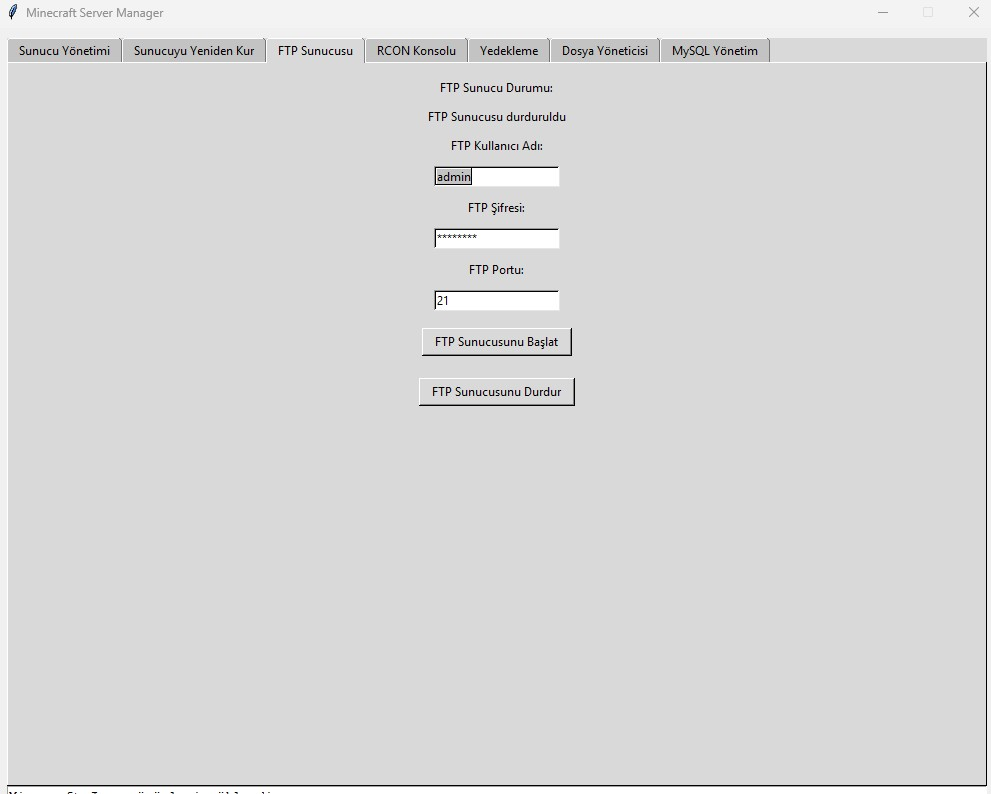
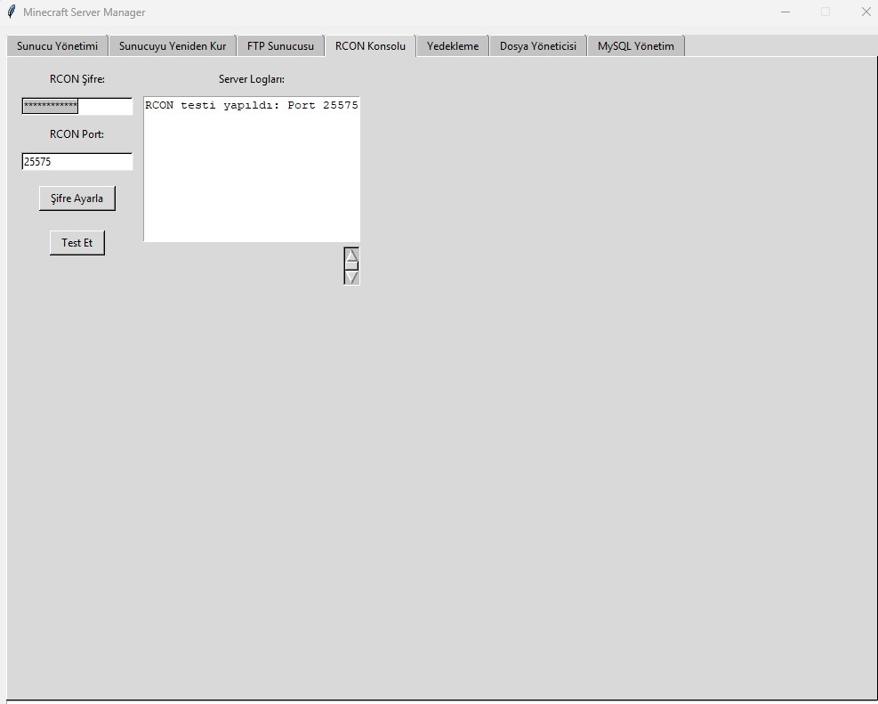
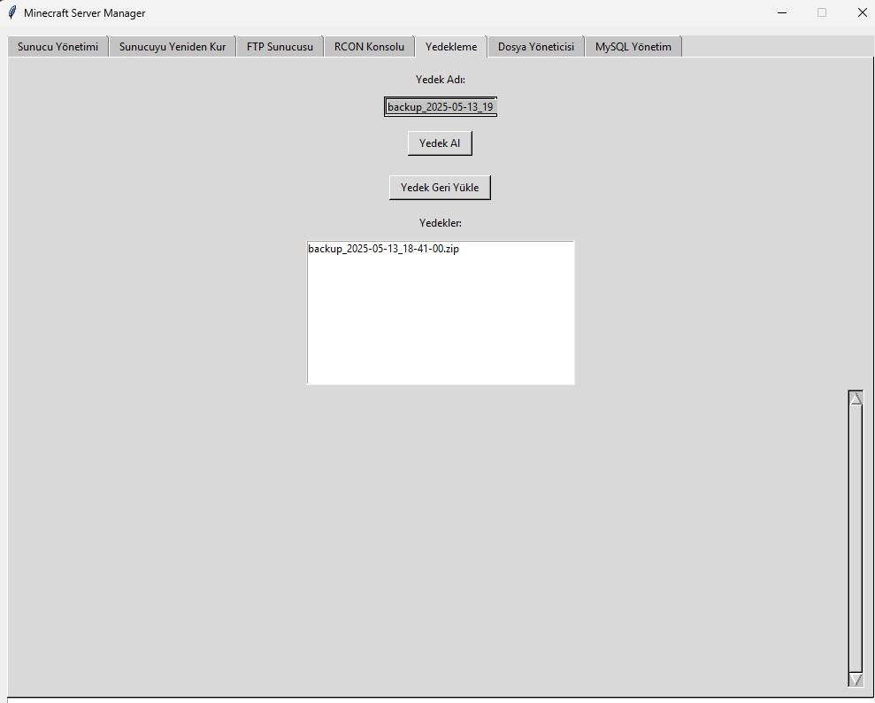
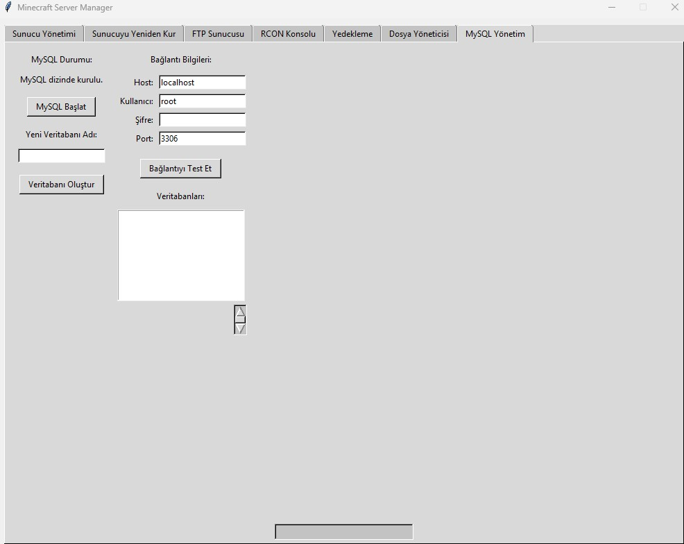
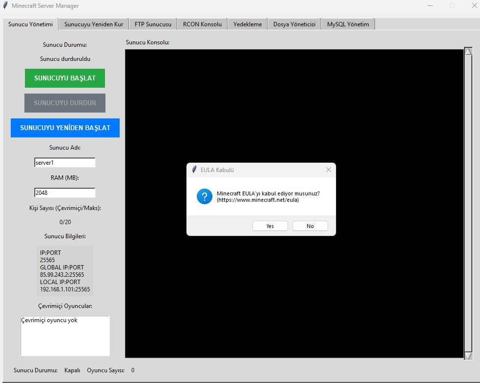
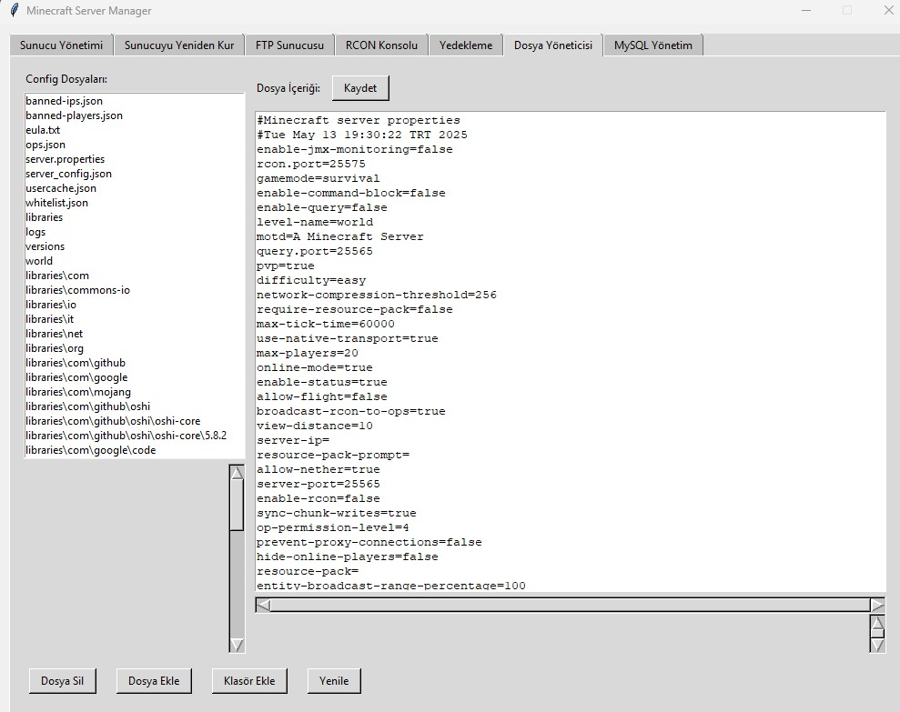

# Minecraft-Server-Manager
Minecraft sunucunuzu kolayca başlatın, yönetin, mod kurun, yedek alın ve çok daha fazlasını yapın!


## 🚀 Özellikler

- ✅ Sunucu Başlatma/Durdurma/Yeniden Başlatma
- 🔧 Minecraft ve modpack kurulumu (CurseForge & Vanilla)
- ☕ Gerekli Java sürümünü otomatik indirip kurma
- 💾 Sunucu yedekleme ve geri yükleme
- 📂 Dosya düzenleme (config dosyaları vs.)
- 🌐 Entegre FTP sunucu (kullanıcı adı/parola ve port ayarlanabilir)
- 🔌 RCON şifre ve port ayarı + Konsol logları
- 🛢️ Portable MySQL kurulumu ve veritabanı yönetimi
- 🖥️ Log görüntüleme alanı
- 🖱️ Tamamen grafik arayüz (Tkinter)

## 🛠 Kurulum

> Python 3.8+ kurulu olmalıdır.

1. Gerekli kütüphaneleri yükleyin:
   ```bash
   pip install -r requirements.txt
   ```
2. Programı Çalıştırma
```bash
python main.py
```
## Özellikler

- **Sunucu Kurulumu**:
  - Vanilya Minecraft sunucularını (1.16.5 - 1.21 sürümleri) otomatik Java sürümü seçimiyle kurun.
  - SkyFactory 4 gibi CurseForge mod paketlerini mod indirme ve sunucu kurulumuyla birlikte kurun.
- **Mod Yönetimi**:
  - CurseForge API'sini kullanarak mod paketleri için modları otomatik indirir.
  - Mod indirme ilerlemesini gerçek zamanlı gösterir (ör. "Modlar İndiriliyor .... Toplam: 100 İndirilen: 5").
- **Sunucu Yönetimi**:
  - Tek tıkla sunucuyu başlatma, durdurma ve yeniden başlatma.
  - Sunucu durumunu, çevrimiçi oyuncuları ve IP/port bilgilerini gerçek zamanlı izleme.
  - Sunucu özelliklerini (port, maksimum oyuncu, MOTD vb.) arayüz üzerinden yapılandırma.
- **Yedekleme ve Geri Yükleme**:
  - Yeni sunucu veya mod paketi kurmadan önce yedek alma.
  - Kurulum hatalarında önceki sunucu durumunu geri yükleme.
- **Java Desteği**:
  - Gerekli Java sürümünü (ör. SkyFactory 4 için Java 17, yeni sürümler için Java 21) otomatik indirir ve yapılandırır.
  - Java sürüm uyumsuzluklarını algılar ve uygun sürümü kurar.
- **Kullanıcı Dostu Arayüz**:
  - Tkinter tabanlı, temiz bir arayüzle mod paketlerini tarama, logları görüntüleme ve sunucuları yönetme.
  - Renk kodlu (BİLGİ, UYARI, HATA) gerçek zamanlı konsol çıktıları.
- **Çapraz Platform**:
  - Windows ve Linux desteği (macOS test edilmemiştir).

## Ekran Görüntüleri
Uygulamanın bazı işlevsel ekranlarına dair örnekler aşağıda sunulmuştur:

### 🎛️ Sunucu Kontrol Paneli
Minecraft sunucusunu başlatma, durdurma ve yeniden başlatma; IP bilgileri, çevrimiçi oyuncular ve RAM ayarları.


---

### 🖥️ Sunucu Konsolu ve Log Takibi
Sunucu loglarını gerçek zamanlı görüntüleme paneli.


---

### 📜 EULA Kabul Penceresi
Sunucunun çalışabilmesi için gereken EULA onayı kullanıcıya sorulur.


---

### 🧾 Dosya Yöneticisi (Config Düzenleme)
server.properties dahil yapılandırma dosyalarını düzenleyebileceğiniz entegre bir metin editörü.


---

### 🗃️ Sunucu Yedekleme Paneli
Yedek alıp geri yükleme işlemleri kolayca yapılabilir.


---

### 🔌 RCON Yönetimi
RCON şifresi belirleme ve bağlantı testi yapılabilir.


---

### 🌐 FTP Sunucu Ayarları
Kullanıcı adı, şifre ve port belirleyerek FTP sunucusunu başlatıp durdurabilirsiniz.


---

### 🔁 Minecraft Sürüm Kurulumu (Vanilla)
Minecraft'ın tüm Vanilla sürümleri listelenir, tek tıklamayla kurulum yapılabilir.


---

### 🔥 Modpack Kurulumu (CurseForge)
CurseForge modpack'leri API üzerinden çekilir ve kurulabilir.


---

### 📋 Log Alanı ve Bildirimler
Konsola yazılan her işlem bu alanda da saklanır, başlatıldığında durumlar burada görülür.


---

### 🛢️ MySQL Yönetimi
Portable MySQL kurulumu sonrası veritabanı oluşturma ve test etme ekranı.


## Ön Koşullar

- **Python**: 3.8 veya üzeri sürüm.
- **İşletim Sistemi**: Windows veya Linux (macOS desteklenmeyebilir, test edilmemiştir).
- **Bağımlılıklar**: Gerekli Python paketlerini kurun (bkz. [Kurulum](#kurulum)).
- **CurseForge API Anahtarı**: Mod paketleri ve modları indirmek için gereklidir (bkz. [Yapılandırma](#yapılandırma)).
- **İnternet Bağlantısı**: Java, Minecraft sunucuları ve mod paketlerini indirmek için gerekli.

.
├── main.py                # Ana GUI ve sekmeler
├── server_manager.py      # Sunucu kontrolü
├── install_manager.py     # Kurulum ve mod yükleyici
├── ftp_manager.py         # FTP sunucu yönetimi
├── rcon_manager.py        # RCON ayarları
├── backup_manager.py      # Yedekleme işlemleri
├── file_manager.py        # Dosya düzenleyici
├── mysql_manager.py       # MySQL kurulumu ve yönetimi
├── servers/               # Sunucu klasörleri
├── backups/               # Yedek dosyaları
└── logs/                  # Günlük kayıtları
